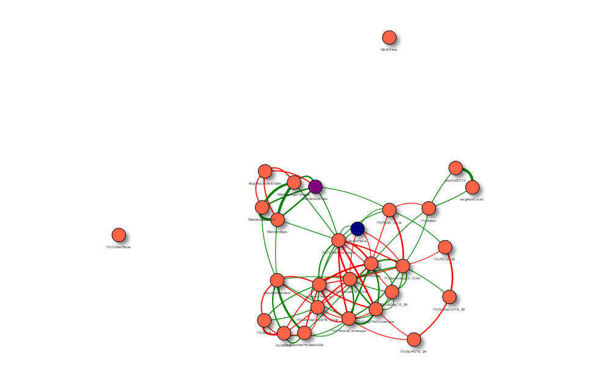

```{r setup, include=FALSE}
knitr::opts_chunk$set(echo = TRUE)
```

##  Setup


```{r include=FALSE}
library(dplyr)
library(tidyr)
library(repr)
library(car)
library(fBasics)
library(xtable)
source("box_hist.R")
source("outliers.R")
options(repr.plot.width=5, repr.plot.height=5)
```

Data transformations

```{r}
Cancer <- read.csv('cancer.csv', row.names = 1)
Cancer <- Cancer %>% separate(Geography, c("County", "State"), sep = ", ", remove = FALSE)
Cancer$MedianAge[Cancer$MedianAge > 100] <- NA
Cancer$AvgHouseholdSize[Cancer$AvgHouseholdSize < 1] <- NA
bins <- seq(20000, 130000, by = 10000)
Cancer$binnedInc2 <- cut(Cancer$medIncome, breaks = bins)
# Cancer$avgAnnCount[Cancer$avgAnnCount == 1962.667684] <- NA
# Cancer$incidenceRate <- Cancer$avgAnnCount / Cancer$popEst2015 * 100000
Cancer$death_count <- Cancer$deathRate * Cancer$popEst2015/100000
Cancer$Pct_insured <- Cancer$PctPrivateCoverage + Cancer$PctPublicCoverage
Cancer$Pct_PersonalIsure <- Cancer$PctPrivateCoverage + Cancer$PctEmpPrivCoverage
```


# 2. Univariate Analysis of Key Variables

Even though the presentation of this section takes a linear form, the actual analysis of key variables was an iterative process, where the key variables were chosen based on our initial hypotheses about what variables were related to `deathRate`, which of these would be good candidates to target through public policy and the data analysis performed to identify which of these variables in fact had a correlation with the dependent variable.

After selecting these variables, our approach was to focus on assessing the quality of the data (part of which is reflected in section 1) and detecting features through univariate analysis that are important to include when modelling the relationships of interest, such as particular features in the distributions, unusual concentrations of observations around certain values, the presence of outliers and extreme outliers, among others.

### Death rate

Death rate's distribution is symmetric and bell-shaped, with a small amount of outliers at both sides of the mean (2.1% of outliers, with 0.03% of extreme outliers). However, these outliers are still within a reasonable range and do not seem to be errors in the data. Furthermore, the observation corresponding to the only extreme outlier does not look atypical based on the values of the other variables.

Finally, using both summary metrics and visualizations, we did not find an unusual concentration of observations around specific values.


```{r}
summary(Cancer$deathRate)
```
```{r}
boxHist(Cancer$deathRate, "Death rate (nummber of deaths per 100k people)")
``` 

```{r}
outliers.summ(Cancer, 'deathRate')
```

```{r}
Cancer[Cancer$deathRate > 300, ]
```

### Incidence (DEATILS COULD BE HIDDEN TO SAVE SPACE)

Looking at the frequency of unique values in the AvgAnnCount (incidence) variable, we found that 206 observations contain the value 1962.667684. This is very likely an error because the values of this variable should all be integers, and in some cases this value is higher than the county population.

```{r incidence_freq}
incidence_freq <- data.frame(table(Cancer$avgAnnCount))
incidence_freq[incidence_freq$Freq > 20, ]
```

```{r}
table(Cancer$avgAnnCount > Cancer$popEst2015)
```

Furthermore, these values are causing the incidence rate (that we will build to be able to compare death with incidence) to have extremely large values.

Incidence rate contains 188 extremely large values (higher than 1500 cases per 100,000 people). As can be seen below, all of these values are caused by the error in AvgAnnCount.

```{r}
Cancer$incidenceRate <- Cancer$avgAnnCount / Cancer$popEst2015 * 100000
table(Cancer$incidenceRate > 1500)
table(Cancer$incidenceRate[Cancer$avgAnnCount != 1962.667684] > 1500)
```

Therefore, we decided to remove these "1962.667684" values and replace them with NA.

```{r}
Cancer$avgAnnCount[Cancer$avgAnnCount == 1962.667684] <- NA
Cancer$incidenceRate <- Cancer$avgAnnCount / Cancer$popEst2015 * 100000
```

```{r}
outliers.summ(Cancer, 'avgAnnCount')
```


### Incidence rate

The distribution of the incidence rate is unimodal and positively skewed, with 46 outliers and 1 extreme outlier. Since these values represent only 1.5% of observations and there is no furhter evidence that they are errors, they will be kept, but should be taken into account when modelling the relationship between incidence and death rates.

```{r}
summary(Cancer$incidenceRate)
```

```{r}
boxHist(Cancer$incidenceRate, "Incidence rate (new diagnosed cases per 100k people)")
```

```{r}
outliers.summ(Cancer, 'incidenceRate')
```

### Median income

There are two income variables available: binned income and median income. From these two, We chose median income as our key variable because it is more granular than binned income and, second, because the width of the binned income seem to have been defined to have a similar number of observations in each bin, which is not useful to observe its distribution, and the cutoffs chosen make the charts hard to read.

```{r}
summary(Cancer$binnedInc)
```

Below, we can see that the median income is inded a good candidate, since it doesn't vary as much as income typically does (in this case, the difference between the minimum and maximum values is less than one order of magnitude), representing better the "average" member of each county. However, it's distribution is positively sekewed, having 64 counties where the median income is higher than 80,000 USD.

```{r}
summary(Cancer$medIncome)
```

```{r}
sum(Cancer$medIncome > 80000)
```

```{r}
boxHist(Cancer$medIncome, "Median income")
```

Including the 64 observations above that contribute to the positive skewness of this variable, there are still 122 outliers (around 4% of the total observations) that need to be taken into account when building the statistical model that captures the relationship between this variable and the death rate.

```{r}
outliers.summ(Cancer, "medIncome")
```

Given the rather large number of outliers in this variable, we could transform it by taking its logarithm. However, we have decided to follow the rule provided by Fox (2011), where logarithmic transformation is only likely to make a difference if its values "cover two or more orders of magnitude" (Fox, p. 128).


### Education

To measure education, we have six possible candidates: 'PctNoHS18_24', 'PctHS18_24', 'PctSomeCol18_24', 'PctBachDeg18_24', 'PctHS25_Over' and 'PctBachDeg25_Over' that can be divided in two groups: 18-24 and '25 and above' years old. Our initial hypothesis is that the second group should have a stronger correlation with death rate. We validated this hypothesis with the correlations table shown below, that found that only PctBachDeg from the 18-24 group has a correlation with deathRate (although this correlation is very week, -0.31). Instead, as expected, the two'25 and above' education variables have a much higher correlation with deathRate.

Therefore, we will focus on these two variables for further analyses on education.

```{r}
cor(Cancer[, names(Cancer) %in% 
           c('PctNoHS18_24', 'PctHS18_24', 'PctSomeCol18_24', 'PctBachDeg18_24', 
             'PctHS25_Over', 'PctBachDeg25_Over', 'deathRate')], use = 'complete.obs')[7, ]
```

We also validated that education variables within each group are mutually exclusive, by making sure that they add up to 100%, for all observations that have complete data, where we find that these variables indeed seem to be mutually exclusive, given that their range is between 99.9 and 100.1, where the small variations around 100 are likely due to rounding.

We can only test this with the 18-24 group since the 25_over group is missing two variables that capture 'no high school' and 'some college'. However, it is reasonable to assume that the same definition is applied to our group of interest (25_over).

```{r}
educ.18.24 <- c('PctNoHS18_24', 'PctHS18_24', 'PctSomeCol18_24', 'PctBachDeg18_24')
educ.df <- subset(Cancer, select = educ.18.24)
educ.complete <- complete.cases(educ.df)
sum.pct.freq <- data.frame(table(rowSums(educ.df[educ.complete, ], na.rm = TRUE)))
names(sum.pct.freq) <- c("Sum", "Frequency")
sum.pct.freq
```


#### PctHS25_over

Values in `PctHS25` are within a reasonable range (7 to 55%) and there doesn't seem to be an unusual concentration of observations around certain values. Also, the disribution of this variable is unimodal and negatively skewed. However, it only contains 31 outliers (1% of observations) and there are no extreme outliers. Furthermore, there are no indications that these outliers are errors, so we decided to keep them.

```{r}
summary(Cancer$PctHS25_Over)
```


```{r}
boxHist(Cancer$PctHS25_Over, "Percentage age 25 or older with high school only")
```


```{r}
outliers.summ(Cancer, "PctHS25_Over")
```


#### PctBachDeg25_Over

Values in `PctHS25_Over` are within a reasonable range (7% to 55%) and there doesn't seem to be an unusual concentration of observations around certain values. The disribution of this variable is unimodal and positively skewed. It contains 82 outliers (2.7% of observations) all of which at are at the right side of the mean. Of these 82 outliers, only 5 are extreme outliers, that will be kept in the data set, since there are no indications that they are errors.

```{r}
summary(Cancer$PctBachDeg25_Over)
```


```{r}
boxHist(Cancer$PctBachDeg25_Over, "Percentage age 25 or older with bachelors degree only")
```


Extreme outliers
```{r}
outliers.summ(Cancer, "PctBachDeg25_Over")
```


### Poverty percent

The distribution of `povertyPercent` is unimodal and positively skewed. This is reflected by the fact that all outliers are at the right of the mean. Taking a deeper dive into the outliers, we found that only 3 are extreme while 66 are mild. For this reason, and because we did not find other indication that the outliers or other values were errors, we will keep all data from this variable.

However, when modeling the relationship of interest, we should take into account that the distribution of this variable is not normal and it may be necessary to transform it if the model used requires it.

```{r}
summary(Cancer$povertyPercent)
```

```{r}
boxHist(Cancer$povertyPercent, "Percentage age 25 or older with up to bachelors degree")
```

Extreme outliers
```{r}
outliers.summ(Cancer, "povertyPercent")
```


### Percentage employed (16 or over)

The distribution of `PctEmployed16_Over` is unimodal and negatively skewed. This is reflected by the fact that all but one of the outliers are at the left of the mean. There are no extreme outliers and 20 mild outliers (0.7% of observations). For this reason, and because we did not find other indication that the outliers or other values were errors, we will keep all data from this variable.


```{r}
summary(Cancer$PctEmployed16_Over)
```

```{r}
boxHist(Cancer$PctEmployed16_Over, "Percentage age 25 or older with up to bachelors degree")
```

Extreme outliers
```{r}
outliers.summ(Cancer, "PctEmployed16_Over")
```

### Percentage with public coverage

The distribution of `PctPublicCoverage` is unimodal and symmetric, with no extreme outliers and only 18 mild outliers (0.6% of observations). For this reason, and because we did not find other indication that the outliers or other values were errors, we will keep all data from this variable. There are also no other particular features from this variables that grant further warnings in modelling the relationship between it and `deathRate`.


```{r}
summary(Cancer$PctPublicCoverage)
```

```{r}
boxHist(Cancer$PctPublicCoverage, "Percentage age 25 or older with up to bachelors degree")
```

Extreme outliers
```{r}
outliers.summ(Cancer, "PctPublicCoverage")
```


## 3. Analysis of Key Relationships

### Education

As explained above, guided by our hypothesis that the education of the '25 and over' years old group should have a much stronger relationship with deathRate than the '18-24' years old group, which was supported by the correlations between these variables, we will be focusing on the former group.

#### PctHS25_over

A correlation of $0.4$ between `PctHS25_over` and `deathRate` indicates that there is indeed a relationship between these variables, which is further indicated by plotting them together in a scatterplot, that shows that higher values of percentage of population with only high school tend to be associated to higher death rates (this is also reflected in the regression line added to the scatterplot).

This is an intuitive result since it indicates that a higher concentration of people with low education levels may have poorer health habits and lower access to medical services. However, both of these variables could be affeccted by `MedianAge` in the same direction: older counties might have lower levels of higher education and higher rates of death.

```{r collapse=TRUE}
cor(Cancer$deathRate, Cancer$PctHS25_Over)
```

```{r}
plot(Cancer$PctHS25_Over, Cancer$deathRate, main = "HS (>24)")
abline(lm(Cancer$deathRate ~ Cancer$PctHS25_Over), lty = 'dashed', lwd = 2, col = 'red')
```


#### PctBachDeg25_0ver

A correlation of $-0.48$ indicates that there is relationship between `PctBachDeg25_over` and `deathRate`, which is further supported by plotting these variables in a scatterplot, where it can be seen that higher values of percentage of people with bachelors degree are associated to lower levels of death rates. This relationship is  also supported by the regression line included in the scatterplot.

This is also an intuitive result, since higher levels of education might be linked to better health habits and access to health services. However, and following the same reasoning than `PctHS25_over`, the relationship between these two variables may be confounded by `MedianAge`, although it is not clear in which direction this effect might go. Therefore, it will also be necessary to explore the effect of `MedianAge` in the following section.

```{r}
cor(Cancer$deathRate, Cancer$PctBachDeg25_Over)
```

```{r}
plot(Cancer$PctBachDeg25_Over, Cancer$deathRate, main = "Bachelor (>24)")
abline(lm(Cancer$deathRate ~ Cancer$PctBachDeg25_Over), lty = 'dashed', lwd = 2, col = 'red')
```


## 4. Analysis of Secondary Effects

Throughout the analyses above, we began to identify that some of the relationships found between `deathRate` and other variables may not only be capturing the direct relationship betwee these variables but of additional variable(s) that may be impacting both. To further assess this systematically, the following network visualization shows the variables that have a correlation higher than 0.4, where each node represents a different variable and each vertex indicates the strength of the relationship between the variables connected.





### Age and family/householdd

`PercentMarried` has a (weak) relation and `AvgHouseholdSize` has a moderate relation with `MedianAge`. Based on these results, we explored this relationship further.

```{r}
cor(subset(Cancer, 
           select = c("MedianAge", "AvgHouseholdSize", "PercentMarried")), 
    use = "pairwise.complete.obs")[1, ]
```

Both the scatterplots below and the regression lines imposed on them provide further support that there is indeed a relationship between these two variabes and `MedianAge`, indicating that `MedianAge` may confound the relationship between these two and `deathRate`. Therefore, this should be taken into account when modelling the relation of interest, in order to isolate the effect of the family variables on the death rate.

```{r}
plot(Cancer$MedianAge, Cancer$PercentMarried, main = "Age vs PercentMarried")
abline(lm(PercentMarried ~ MedianAge, data = Cancer), lty = 'dashed', lwd = 2, col = 'red')
```

```{r}
plot(Cancer$MedianAge, Cancer$AvgHouseholdSize, main = "Age vs Average household size")
abline(lm(AvgHouseholdSize ~ MedianAge, data = Cancer), lty = 'dashed', lwd = 2, col = 'red')
```


### Black population and employment

Correlation analysis shows that there is a relationship between the percentage of black population and employment, which is further confirmed both by a visual inspection of the scatterplot and the linear regression line charted in this plot. Since employment es related to `deathRate`, its correlation with `PctBlack` may indicate that this variable may be confounding the relationship of interest and thus further modeling needs to take this into account, to isolate the effect of unemployment on death rate.

```{r}
cor(subset(Cancer, select = c("PctBlack", "PctUnemployed16_Over")),
    use = "pairwise.complete.obs")[, 1]
```

```{r}
plot(Cancer$PctBlack, Cancer$PctUnemployed16_Over, main = "Age vs PercentMarried")
abline(lm(PctUnemployed16_Over ~ PctBlack, data = Cancer), lty = 'dashed', lwd = 2, col = 'red')
```


### State

A boxplot containing different location measures of `deathRate` by `State` shows that these values vary measures vary significantly across state. Since `State` may be capturing several state-level characteristics that may in turn affect other variables that have a relation with `deathRate`, it is recommended to include state-level effects when modeling the relation of interest, to control for confounding these state-level factors.

```{r}
boxplot(Cancer$deathRate ~ Cancer$State)
```
